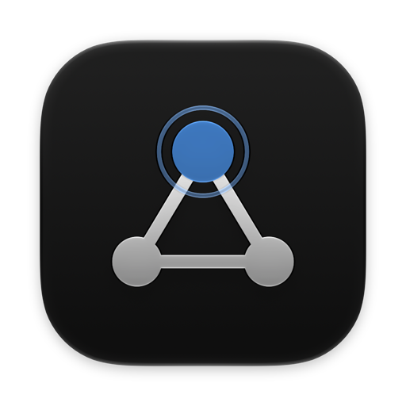
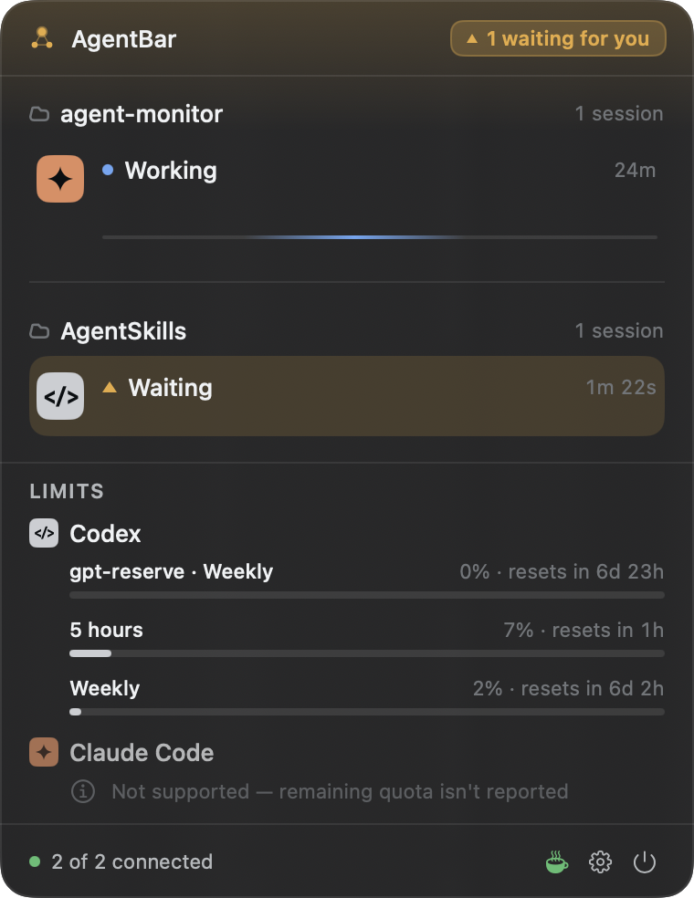
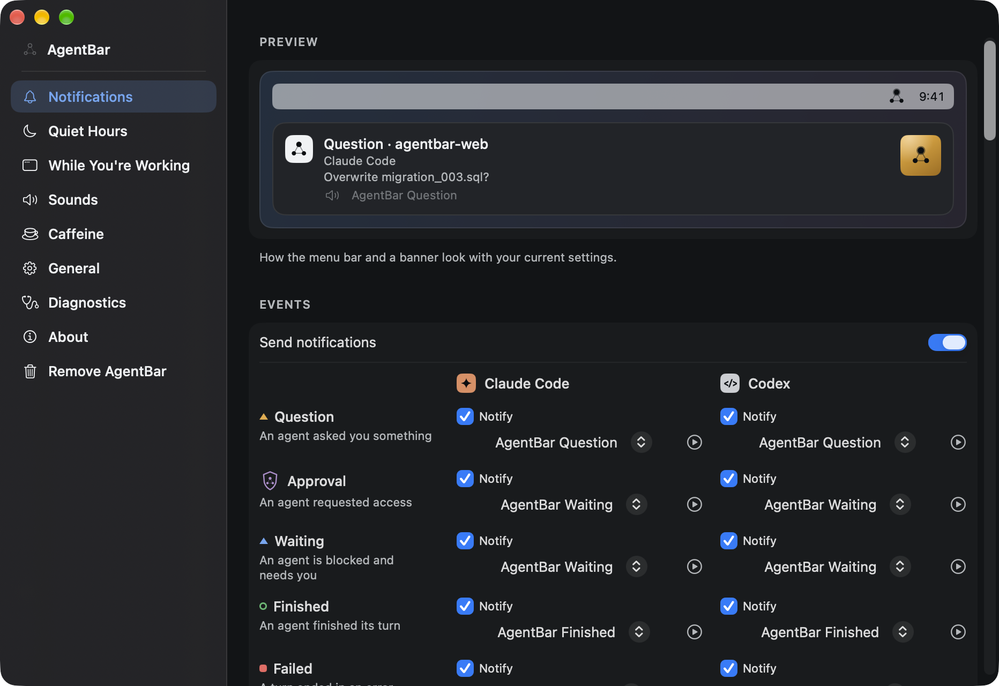
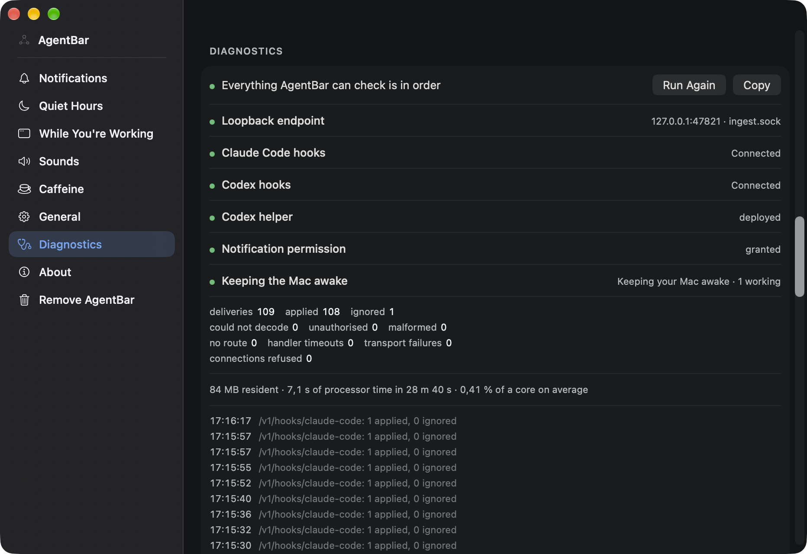

<div align="center">



# AgentBar

**Know the moment a coding agent needs you.**

A native macOS menu-bar app that watches [Claude Code](https://code.claude.com)
and [OpenAI Codex](https://learn.chatgpt.com) sessions: live status per project,
a notification when an agent stops for a human, Codex subscription limits, and a
Mac that stays awake while work is running.

[](https://github.com/molodykhvitaliy/agent-monitor/actions/workflows/ci.yml)
[](https://github.com/molodykhvitaliy/agent-monitor/releases/latest)
[](#requirements)
[](Package.swift)
[](LICENSE)



</div>

> **Open source, built from source.** There is no Apple Developer Program
> membership behind this project, so there is no signed, notarized download — and
> rather than pretend otherwise, the recommended way in is to build it yourself,
> which takes two commands and no account of any kind. A tagged release also
> publishes an unsigned build for people who would rather not
> ([why](docs/adr/ADR-0015-distribution-is-source-first-until-a-developer-id-exists.md)).

## What it does

Agents work autonomously for minutes and then stop, needing a human. AgentBar
makes those pauses visible:

- **Notifications** for the five moments that need you — an agent asked you
  something, requested access, is blocked, finished its turn, or ended in an
  error — each carrying which agent, what it needs and which project, with a
  switch and a sound of its own per provider.
- **Menu-bar status** — every session grouped by project, with its state, current
  tool, duration and subagent count.
- **Codex subscription limits**, rendered from whatever usage windows the local
  `codex app-server` reports — never a figure AgentBar fetched itself.
- **Caffeine** — keeps the Mac awake while an agent is working.
- **Quiet Hours** and a **While You're Working** list, so a banner does not arrive
  in the middle of the night or on top of the app you are presenting from.
- **Diagnostics** — a self-test and the endpoint's own counters, so a user who
  sees nothing happening can find out why without opening Console.

## How it works

AgentBar uses the **documented lifecycle hooks** of both tools. Claude Code posts
events to a loopback endpoint directly; Codex invokes a small compiled helper that
relays them.

```
Claude Code ──[http hook]────────┐
                                 ├──► loopback ingest ──► SessionStore ──► UI
Codex ──[command hook]──► helper ─┘                          │
                                                             ├──► notifications
codex app-server ──[JSON-RPC/stdio]──► quota ────────────────┤
                                                             └──► caffeine
```

It is a strictly additive layer. If AgentBar is not running, has crashed, or is
uninstalled, **both tools behave exactly as if it never existed.**

## Requirements

| | |
|---|---|
| **macOS** | 26 or later |
| **Build** | **Xcode** — not just the command-line tools; the build compiles a layered app icon with `actool` |
| **Tooling** | [Homebrew](https://brew.sh), which `make bootstrap` uses to install xcodegen, swiftlint and xcbeautify |
| **Apple account** | none — the build signs ad-hoc |
| **Agents** | Claude Code, Codex, or both — hooks are installed for each, and a tool you do not run simply never calls them |

The platform facts AgentBar depends on are verified against primary sources and
recorded with a date in
[docs/dev/platform-integration.md](docs/dev/platform-integration.md). The
versions they were last checked against are pinned in
[`.github/verified-versions.json`](.github/verified-versions.json), and a weekly
workflow opens an issue when either tool moves past them.

## Install

```bash
git clone https://github.com/molodykhvitaliy/agent-monitor.git
cd agent-monitor
make bootstrap    # installs xcodegen, swiftlint, xcbeautify; generates the project
make install      # Release build, then places it in /Applications
```

Then, **in this order**:

1. **Launch it from `/Applications`.** Not from `dist/`, and not from Xcode's
   build directory.
2. **Allow notifications** when macOS asks.
3. **Finish onboarding** — it installs the Claude Code and Codex hooks, and Codex
   will ask you to approve its hook in `/hooks`.

> **Launch it from `/Applications` and nowhere else, the first time.** Asking for
> notification permission from a bundle inside Xcode's `DerivedData` fails, and
> macOS records that refusal against the app's identifier **permanently** —
> reinstalling does not undo it, and the only way back is a switch in System
> Settings. `make install` exists to make the right order the easy one. The
> details are in
> [docs/dev/platform-integration.md](docs/dev/platform-integration.md) §6.3.

## Updating

```bash
git pull && make install
```

Quit AgentBar from its menu-bar item first — `make install` refuses to replace a
bundle it is running out of. Codex will **not** ask you to approve its hook
again: the hook names a stable path AgentBar owns rather than one inside the app
bundle.

## Downloading instead

Each tagged release carries `AgentBar-<version>.zip` and its SHA-256. That build
is **ad-hoc signed and not notarized**, because notarization requires the
membership this project does not have. macOS quarantines anything a browser
downloads, so Gatekeeper will refuse it until you say otherwise:

```bash
shasum -a 256 -c AgentBar-*.zip.sha256   # catches a truncated or corrupted download
unzip AgentBar-*.zip
# Updating? Quit AgentBar from its menu-bar item, then remove the old bundle —
# mv refuses to merge over one that is already there.
rm -rf /Applications/AgentBar.app
mv AgentBar.app /Applications/
xattr -d -r com.apple.quarantine /Applications/AgentBar.app
open /Applications/AgentBar.app
```

If `xattr` reports `option -r not recognized`, a `pip`-installed `xattr` is
shadowing the system one — use `/usr/bin/xattr`.

**The checksum is not a signature.** It is published by the same job, on the same
release page, as the file it describes, and nothing signs either — so it tells
you the download arrived intact, and nothing at all about whether the release
itself is what the author intended. Only notarization would tell you that, and
there is none.

Clearing quarantine is you deciding to trust a binary a stranger built. Building
from source means you do not have to: it is the same application, from source you
can read, and it never acquires the attribute in the first place.

## Settings



The window opens onto a **live preview** of the menu bar and a banner as your
current settings would produce them, so a toggle does not have to be imagined.
Below it, every event type gets its own row and every provider its own column:
what to notify about, and which sound, per pair.

The rest of the sidebar is **Quiet Hours**, the **While You're Working**
application list, **Sounds** — an authored pack, plus any `.aiff`, `.wav` or
`.caf` you add — **Caffeine**, **General** for launch at login, **Diagnostics**,
and **Remove AgentBar**.

### When nothing seems to be happening



AgentBar answers **every** hook with success whatever happens, because a hook that
fails is a hook that can stall the agent that called it. The cost of that promise
is that a payload it could not read is invisible to the agent — so Diagnostics is
where it becomes visible instead: a self-test over every integration, the
endpoint's own counters, this process's resource use, and the last hundred
deliveries it saw.

## Removing it

Settings › **Remove AgentBar** takes the hooks back out of
`~/.claude/settings.json` and `~/.codex/hooks.json`, deletes the Codex helper,
unregisters the login item and removes what AgentBar keeps in Application
Support — backing up each configuration file beside itself first, touching
nothing anyone else put there, and reporting every step separately. Anything it
cannot remove is named with the exact file and what to do about it.

Do this **before** moving the app to the Trash. A deleted app leaves its hooks
behind, and both tools would go on calling an endpoint that no longer answers.

## Terms of Service

**AgentBar makes no network request to Anthropic or OpenAI. Ever.**

It holds no credentials and originates no provider requests. It receives events
from harnesses the user already runs under their own credentials, and reads local
files those harnesses write.

One consequence is visible in the interface: Codex exposes a documented local
interface for subscription limits, and Claude Code does not. AgentBar shows Codex
limits and states plainly that Claude Code's remaining quota is unavailable. It
does not estimate.

This boundary is enforced in CI, not just documented — see
[docs/dev/tos-boundary.md](docs/dev/tos-boundary.md).

## Development

```bash
make check       # lint, test, ToS scan, generated models — before every commit
make build       # Debug build
make release     # Release build, packaged into dist/
```

The interface is English-only and there is no string catalogue: every
`String(localized:)` falls back to its key, which is the English text. Adding a
catalogue is a deliberate later step, not an oversight — see
[docs/dev/build.md](docs/dev/build.md).

The Xcode project is generated from `project.yml` and is not committed.

| Document | Contents |
|---|---|
| [CONTRIBUTING.md](CONTRIBUTING.md) | how to build, check and propose a change |
| [SECURITY.md](SECURITY.md) | reporting a vulnerability, and what is in scope |
| [CLAUDE.md](CLAUDE.md) | project instructions (also `AGENTS.md`) |
| [docs/dev/architecture.md](docs/dev/architecture.md) | module boundaries, domain model |
| [docs/dev/build.md](docs/dev/build.md) | build system, toolchain, bundle layout, distribution |
| [docs/dev/platform-integration.md](docs/dev/platform-integration.md) | verified platform facts |
| [docs/dev/tos-boundary.md](docs/dev/tos-boundary.md) | hard project limits |
| [docs/dev/design-system.md](docs/dev/design-system.md) · [design-spec.md](docs/dev/design-spec.md) | tokens, and every surface and state |
| [docs/adr/](docs/adr/) | architecture decision records |

## Affiliation

AgentBar is an independent project. It is **not affiliated with, endorsed by, or
sponsored by Anthropic or OpenAI.** Claude, Claude Code, OpenAI and Codex are
their respective owners' names, used here only to say accurately which tools
AgentBar observes. The provider marks drawn in the interface are original generic
shapes for exactly this reason — see
[docs/dev/design-system.md](docs/dev/design-system.md).

## License

[Apache License 2.0](LICENSE). © 2026 Vitaliy Molodykh.
